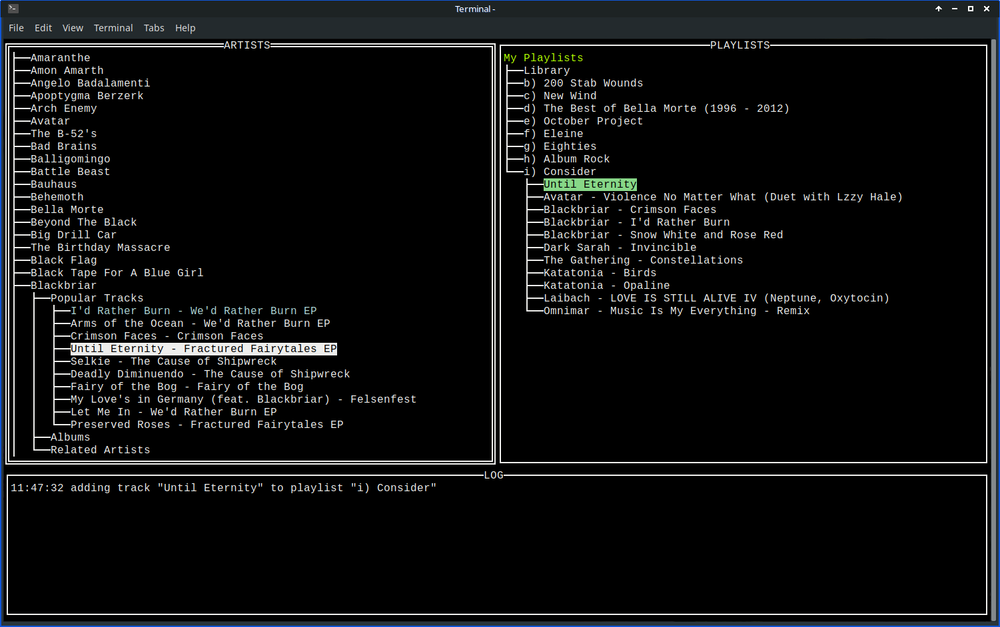

# spotui

A fast terminal-based (TUI) Spotify library browser

## Why

It's a personal project to learn more about terminal-based UI frameworks. While I try to write good code on personal projects, do not assume that this code represents the best way to do things.

## Goal

Add ability to quickly manage playlists and liked tracks. This would make it useful.

## Screenshot

## TODO

escape `[]` chars in tree labels
